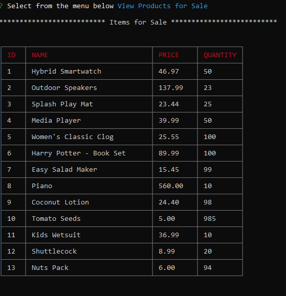

# Bamazon
Customer Order and inventory management app
Amazon like store front application. 

## Problem
Develop an application that could display available items and let customer purchase items.
Bounus applications - Manager view and Supervisor view , which handles inventory and analyze reports

##Instructions
This applicatio has 3 options 

1. BamazonCustomer.js
    * Load the file with Node bamazonCustomer.js
    * Enter item id available from the list to purchase
    * Enter the no of units to purchase
    * When entered the application will display the total cost for the customer and update the inventory

2. BamazonManager.js
    * Load the application with node bamazonManager.js
    * Manager will have several options to choose from 
    * Select the option by going down with arrow keys and press enter

3. BamazonSupervisor.js
    * Load the application with node bamazonSupervisor.js
    * Supervisor will have 2 options in the menu
    *  Select the option by going down with arrow keys and press enter

## Technologies 
  * JavaScript
  * Nodejs
  * Node Module packages
     - inquirer
     - cli-table
     - mysql
  * Git
  * GitHub
  
 ## Demo Images

**Bamazon Customer product list command**

**Bamazon purchase item**

**View Products for Sale**

**View Low Inventory**

**Add to Inventory**

**Add New Product**

**Manager option menu**

**Supervisor Menu**

**View Product Sales by Department**

**Create New Department**
